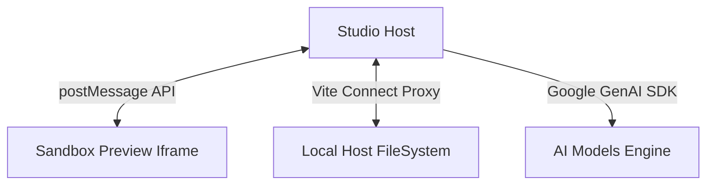

# Project Blueprint & Architectural Architecture

NEXO V2 is structured as an autonomous software studio executing client-side sandboxed compilation.

## 1. System Topology

## 2. Dynamic Component Modules
- **`agents/`**: Contains PM, Designer, DevOps, Frontend, Backend, QA, Security, and Debug agents.
- **`components/`**: Modular layout screens (landing initial, design options, workflow status, audit ratings, sandbox transfer loader).
- **`services/`**: Integration adaptors.
- **`stores/`**: Reactive Zustand state stores representing status updates.

## 3. The 12-Phase Multi-Agent Generation Sequence
1. **Strategic Stage:** Planner extraction -> Concept Selection -> Design Customizer.
2. **Scaffolding Stage:** Checklist creation -> Custom additions -> Confirmation tree.
3. **Execution Stage:** Scaffolder init -> SSE Deep Code Gen -> WebContainer boot.
4. **Validation Stage:** QA/Security ratings -> Deploy boots -> Sandbox redirect.
